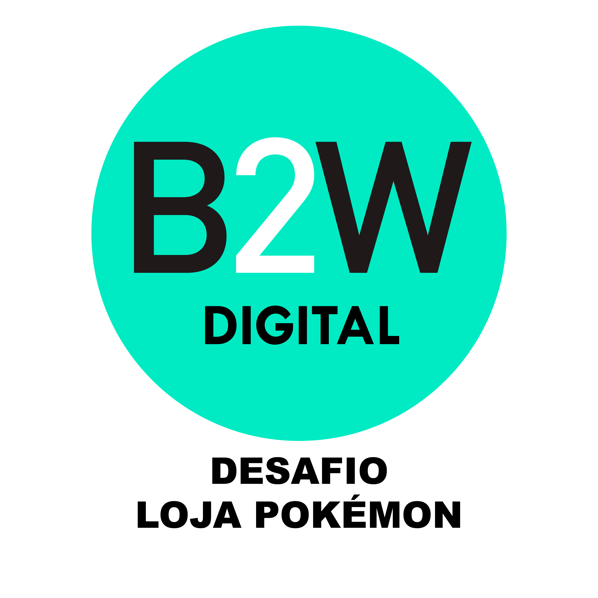

<a aria-label="Netlify" href="https://b2w-challenge.netlify.app/">	
    </img>	
  </a>
<a aria-label="ReactJS" href="https://pt-br.reactjs.org/">
    </img>
  </a>
  <a aria-label="React Router" href="https://reacttraining.com/react-router/web/guides/quick-start">
    </img>
  </a>
  <a aria-label="Styled Components" href="https://styled-components.com/">
    </img>
  </a>
  <a aria-label="Axios" href="https://github.com/axios/axios">
    </img>
  </a>

## Sobre

Projeto criado para o processo seletivo de Front-End na B2W.
O desafio consiste em criar uma loja de pokémon, sendo pelo menos duas lojas com tipos e estilizações diferentes.

Os dados dos pokémon são fornecidos pelo pela [PokeAPI](https://pokeapi.co/).

A arquitetura do projeto segue algumas idéias apresentadas no [Atomic Design](https://bradfrost.com/blog/post/atomic-web-design/)

## Tecnologias utilizadas

A aplicação foi desenvolvida usando a biblioteca [ReactJs](https://pt-br.reactjs.org/) e para cuidar do roteamento entre as lojas o [React-Router](https://reacttraining.com/react-router/web/guides/quick-start). As requisições para a API foram feitas usando um Client HTTP chamado [axios](https://github.com/axios/axios) e estilizada usando [Styled-Components](https://styled-components.com/).

## MVP

- Catálogo de produtos
- Carrinho lateral
- Resumo do carrinho
- 2 lojas com estilos e tipos diferentes de Pokémon

## Extras feitos

- Botão de finalizar compra, reiniciando o processo de compra
- Modal de obrigado ao finalizar compra
- Salvar os dados da compra do usuário localmente para não perdê-las ao atualizar a página

## Preview

